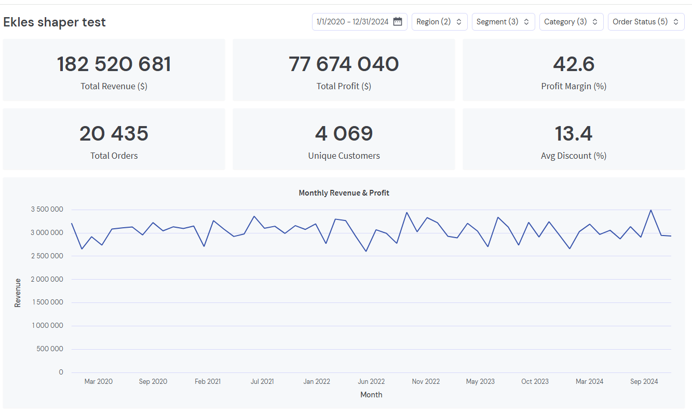

Delta & Shaper demo
==========

This repo generates sample Delta Lake tables and launches Shaper for exploration.

Shaper is a lightweight, SQL-first dashboard tool. It lets you turn a single
`.dashboard.sql` file into an interactive report with filters, charts, and
exports, all backed by DuckDB.



Prereqs
-------
- Python 3.10+ and uv
- Node.js (for npx)

Create a virtual environment
----------------------------
From `pyproject.toml` and `uv.lock` (recommended):

```bash
uv sync
```

If you only have `pyproject.toml`:

```bash
uv sync --no-lock
```

If you already activated a custom venv and want to install into it:

```bash
uv sync --active
```

Generate Delta tables
---------------------
Run the data generator to create the Delta tables under `data/`:

```bash
python simulate_data.py
```

If you are running from `/mnt` on WSL and see Delta write errors, use a Linux path
and (optionally) symlink it so the SQL keeps working:

```bash
export DELTA_OUTPUT_DIR="$HOME/delta-demo-data"
python simulate_data.py
ln -s "$DELTA_OUTPUT_DIR" data
```

Start Shaper
------------
Option A: one-command script (starts server and dev watcher in one terminal):

```bash
chmod +x scripts/run_demo.sh
./scripts/run_demo.sh
```

Option B: two terminals (recommended if you want separate logs):

```bash
npx @taleshaper/shaper
```

```bash
npx @taleshaper/shaper dev
```

When Shaper opens, load the dashboard file:

- [sales_analytics.dashboard.sql](sales_analytics.dashboard.sql)

Notes
-----
- If you want a different output directory, set `DELTA_OUTPUT_DIR`.
- On WSL, writing to `/mnt` mounts can be flaky for Delta; using a Linux path is more reliable.
